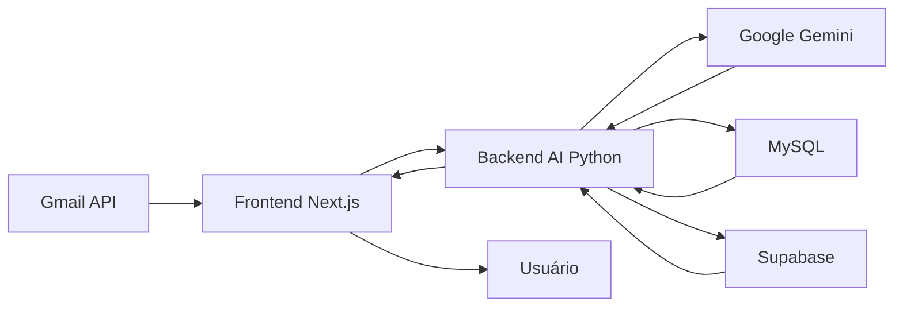

# XMX Email - Sistema Inteligente de Gerenciamento de E-mails com IA

## 📋 Visão Geral

XMX Email é um sistema avançado de gerenciamento de e-mails corporativos que combina a robustez do Gmail API com o poder da inteligência artificial do Google Gemini. O sistema oferece classificação automática, geração de respostas inteligentes e rastreamento de pedidos, tudo em uma interface moderna desenvolvida com Next.js 15.

### 🎯 Objetivo Principal

Automatizar e otimizar o atendimento ao cliente via e-mail, utilizando IA para:
- Classificar automaticamente e-mails (suporte, rastreamento, spam)
- Gerar respostas contextualizadas e profissionais
- Rastrear pedidos e fornecer informações atualizadas
- Reduzir tempo de resposta e aumentar satisfação do cliente

## 🌟 Principais Funcionalidades

### 📧 Gerenciamento de E-mails
- ✅ **Integração Gmail API** - Acesso completo via Service Account
- ✅ **Caixa de Entrada/Enviados** - Visualização organizada
- ✅ **Visualização Detalhada** - Preview completo com ações
- ✅ **Marcar como Lido** - Gestão de status
- ✅ **Interface Responsiva** - Desktop e mobile

### 🤖 Inteligência Artificial
- ✅ **Classificação Automática** - Identifica tipo e urgência
- ✅ **Geração de Respostas** - Respostas contextualizadas com Gemini AI
- ✅ **Sistema de Aprovação** - Review antes do envio
- ✅ **Edição de Respostas** - Ajuste fino pelo usuário
- ✅ **Métricas de Confiança** - Score de certeza da IA

### 📦 Rastreamento
- ✅ **Integração MySQL** - Base de dados de pedidos
- ✅ **Extração Automática** - Identifica códigos de rastreamento
- ✅ **Status em Tempo Real** - Informações atualizadas
- ✅ **Respostas Combinadas** - Une suporte + rastreamento

### 🔐 Segurança
- ✅ **Autenticação Supabase** - Login seguro
- ✅ **API Keys** - Proteção de endpoints
- ✅ **Rate Limiting** - Controle de requisições
- ✅ **CORS Configurado** - Segurança cross-origin

## 🏗️ Arquitetura do Sistema

```
xmx-email/
│
├── 🎨 frontend/              # Next.js 15 + React 19 + TypeScript
│   ├── app/                  # App Router
│   │   ├── (app)/           # Rotas autenticadas
│   │   │   ├── dashboard/   # Painel principal
│   │   │   ├── inbox/       # Caixa de entrada Gmail
│   │   │   ├── sent/        # E-mails enviados
│   │   │   └── llm/         # Dashboard de IA
│   │   ├── api/             # API Routes com integração direta Gmail
│   │   └── login/           # Autenticação Supabase
│   ├── components/          # Componentes React
│   ├── lib/                 # Gmail Service, utilitários e clients
│   └── contexts/            # Context API
│
└── 🤖 backend-ai/           # Python + FastAPI + Gemini AI
    ├── app/
    │   ├── api/v1/          # Endpoints de IA
    │   │   ├── classification.py    # Classificação
    │   │   ├── response_generation.py # Geração
    │   │   ├── tracking.py          # Rastreamento
    │   │   └── emails.py            # Processamento
    │   ├── core/            # Configurações
    │   ├── models/          # Modelos Pydantic
    │   ├── services/        # Serviços de IA
    │   └── db/              # Supabase + MySQL
    └── main.py              # Entry point FastAPI
```

### 📊 Fluxo de Dados



## 🚀 Stack Tecnológica

### Frontend
- **Framework**: Next.js 15.2.4 (App Router)
- **UI Library**: React 19
- **Linguagem**: TypeScript 5
- **Estilização**: Tailwind CSS 3.4
- **Componentes**: shadcn/ui
- **Autenticação**: Supabase Auth (@supabase/ssr)
- **Ícones**: Lucide React
- **Notificações**: Sonner

### Frontend (Integração Gmail)
- **Gmail API**: Integração direta via googleapis
- **Autenticação**: Google Service Account
- **Cache**: In-memory cache service
- **Segurança**: Rate limiting, CORS

### Backend AI (Python)
- **Runtime**: Python 3.11+
- **Framework**: FastAPI
- **AI/LLM**: Google Gemini 2.5 Flash
- **Database**: Supabase (PostgreSQL) + MySQL
- **Validação**: Pydantic V2
- **Logging**: Loguru
- **Async**: Uvicorn + asyncio
- **Rate Limiting**: SlowAPI

## 📦 Instalação Completa

### Pré-requisitos

- Node.js 18+ e npm
- Python 3.11+ e pip
- MySQL Server
- Conta Google Workspace
- Projeto Supabase
- API Key do Google Gemini
- Credenciais Gmail API (Service Account)

### 1. Clone o Repositório

```bash
git clone [seu-repositorio]
cd xmx-email
```

### 2. Configure o Frontend

```bash
cd frontend
npm install --legacy-peer-deps

# Crie .env.local
cat > .env.local << EOL
# Supabase
NEXT_PUBLIC_SUPABASE_URL=https://gtydmzumlicopgkddabh.supabase.co
NEXT_PUBLIC_SUPABASE_ANON_KEY=seu_anon_key_aqui

# Backend APIs
NEXT_PUBLIC_API_URL=http://localhost:3001/api
NEXT_PUBLIC_AI_API_URL=http://localhost:8001/api/v1
EOL
```

### 3. Configure o Backend AI

```bash
cd ../backend-ai

# Crie ambiente virtual
python -m venv venv
source venv/bin/activate  # Linux/Mac
# ou
venv\Scripts\activate  # Windows

# Instale dependências
pip install -r requirements.txt

# Crie .env baseado no exemplo
cp .env.example .env

# Edite .env com suas credenciais:
# - GEMINI_API_KEY: Sua API key do Google Gemini
# - SUPABASE_URL e SUPABASE_KEY
# - MYSQL_* configurações do banco
# - API_KEY para autenticação
```

### 4. Configure o Banco de Dados

#### MySQL (para rastreamento)
```sql
CREATE DATABASE xmx_tracking;
USE xmx_tracking;

-- Tabelas serão criadas automaticamente pelo backend-ai
```

#### Supabase (via Dashboard ou SQL Editor)
```sql
-- Tabelas de processamento de e-mails
CREATE TABLE processed_emails (
    id UUID DEFAULT gen_random_uuid() PRIMARY KEY,
    email_id VARCHAR(255) UNIQUE NOT NULL,
    from_address VARCHAR(255) NOT NULL,
    to_address VARCHAR(255) NOT NULL,
    subject TEXT NOT NULL,
    body TEXT NOT NULL,
    decision VARCHAR(20) NOT NULL,
    confidence DECIMAL(3, 2) NOT NULL,
    email_type VARCHAR(50) NOT NULL,
    urgency VARCHAR(20) NOT NULL,
    reason TEXT NOT NULL,
    suggested_subject TEXT,
    suggested_body TEXT,
    processing_time_seconds DECIMAL(10, 3),
    processed_at TIMESTAMP WITH TIME ZONE DEFAULT NOW()
);

-- Tabelas de prompts de IA
CREATE TABLE ai_prompts (
    id UUID DEFAULT gen_random_uuid() PRIMARY KEY,
    name VARCHAR(255) UNIQUE NOT NULL,
    system_prompt TEXT NOT NULL,
    decision_criteria JSONB NOT NULL,
    active BOOLEAN DEFAULT false,
    created_at TIMESTAMP WITH TIME ZONE DEFAULT NOW()
);
```

### 5. Execute o Sistema

```bash
# Terminal 1 - Backend AI
cd backend-ai
python main.py

# Terminal 2 - Frontend
cd frontend
npm run dev
```

Acesse: http://localhost:3000

## 🔌 Configuração de Variáveis de Ambiente

### Frontend (.env.local)
```env
# Supabase
NEXT_PUBLIC_SUPABASE_URL=https://seu-projeto.supabase.co
NEXT_PUBLIC_SUPABASE_ANON_KEY=sua_anon_key

# AI Backend
NEXT_PUBLIC_AI_API_URL=http://localhost:8001/api/v1
AI_API_KEY=sua-api-key-para-backend-ai

# Google Service Account (server-side)
GOOGLE_SERVICE_ACCOUNT_KEY=./credentials/service-account-key.json
GMAIL_USER_EMAIL=support@biofraga.com
```

### Backend AI (.env)
```env
# API
API_KEY=sua-api-key-segura
API_PORT=8001

# Google Gemini
GEMINI_API_KEY=sua-gemini-api-key
GEMINI_MODEL=gemini-2.5-flash

# Supabase
SUPABASE_URL=https://seu-projeto.supabase.co
SUPABASE_KEY=sua-service-role-key

# MySQL
MYSQL_HOST=localhost
MYSQL_PORT=3306
MYSQL_DATABASE=xmx_tracking
MYSQL_USER=root
MYSQL_PASSWORD=sua-senha

# Security
SECRET_KEY=sua-secret-key-para-jwt
```

## 📡 API Documentation

### Gmail API (Frontend Next.js)

#### Obter Caixa de Entrada
```http
GET http://localhost:3000/api/gmail/inbox
```

#### Obter E-mails Enviados
```http
GET http://localhost:3000/api/gmail/sent
```

#### Obter Detalhes de E-mail
```http
GET http://localhost:3000/api/gmail/message/:id
```

#### Marcar como Lido
```http
POST http://localhost:3000/api/gmail/message/:id/read
```

### AI API (Backend Python)

#### Classificar E-mail
```http
POST http://localhost:8001/api/v1/classification/classify
Content-Type: application/json
Authorization: Bearer {API_KEY}

{
  "email_id": "msg_123",
  "from_address": "cliente@example.com",
  "to_address": "support@biofraga.com",
  "subject": "Dúvida sobre produto",
  "body": "Olá, gostaria de saber...",
  "received_at": "2025-01-15T10:30:00Z"
}
```

Response:
```json
{
  "email_id": "msg_123",
  "is_support": true,
  "is_tracking": false,
  "classification_type": "support",
  "urgency": "medium",
  "confidence": 0.92,
  "extracted_email": "cliente@example.com"
}
```

#### Gerar Resposta
```http
POST http://localhost:8001/api/v1/response/generate
Content-Type: application/json
Authorization: Bearer {API_KEY}

{
  "email_id": "msg_123",
  "email_content": {...},
  "classification": {...},
  "tracking_data": null
}
```

Response:
```json
{
  "email_id": "msg_123",
  "suggested_subject": "Re: Dúvida sobre produto",
  "suggested_body": "Olá! Obrigado por entrar em contato...",
  "tone": "professional",
  "response_type": "support_only",
  "confidence": 0.95,
  "requires_followup": false
}
```

#### Buscar Rastreamento
```http
GET http://localhost:8001/api/v1/tracking/search?email=cliente@example.com
Authorization: Bearer {API_KEY}
```

## 🔄 Fluxo de Processamento de E-mails

### 1. Recepção
- Frontend integra diretamente com Gmail API
- Service Account autentica requisições
- Cache otimiza performance

### 2. Classificação
- Usuário seleciona e-mail para processar
- Backend AI analisa com Gemini
- Determina: tipo, urgência, necessidade de resposta

### 3. Geração de Resposta
- Se classificado como suporte/rastreamento
- Gemini gera resposta contextualizada
- Inclui dados de rastreamento se aplicável

### 4. Aprovação
- Resposta exibida no dashboard LLM
- Usuário pode editar/aprovar
- Sistema mantém log de aprovações

### 5. Envio
- Resposta aprovada é enviada via Gmail API
- Status atualizado no sistema
- Métricas registradas

## 📊 Sistema de Prompts

O backend AI utiliza prompts configuráveis para diferentes cenários:

### Prompt de Classificação
```python
# classification_prompt.txt
Analise o e-mail e determine:
1. É solicitação de suporte? (is_support)
2. É consulta de rastreamento? (is_tracking)
3. Qual a urgência? (high/medium/low)
4. Tipo de e-mail? (question/complaint/request/spam/newsletter)
```

### Prompt de Resposta de Suporte
```python
# support_response_prompt.txt
Gere uma resposta profissional e empática para:
- Resolver a dúvida do cliente
- Fornecer informações claras
- Oferecer próximos passos
```

### Prompt Combinado (Suporte + Rastreamento)
```python
# combined_response_prompt.txt
Responda incluindo:
- Solução para a dúvida
- Informações de rastreamento
- Status atualizado do pedido
```

## 🚧 Funcionalidades Implementadas vs Em Desenvolvimento

### ✅ Completas
- Sistema de login/logout com Supabase
- Listagem de e-mails (inbox/sent)
- Visualização detalhada de e-mails
- Marcar como lido
- Classificação automática com IA
- Geração de respostas com Gemini
- Sistema de aprovação/edição
- Dashboard LLM com métricas
- Rastreamento de pedidos MySQL
- Interface responsiva
- Loading states e empty states
- Cache inteligente

### 🚧 Em Desenvolvimento
- Composição de novos e-mails
- Busca e filtros avançados
- Anexos de arquivos
- Notificações em tempo real (webhooks)
- Paginação para grandes volumes
- Auto-resposta direta sem aprovação
- Templates de resposta personalizáveis
- Analytics dashboard completo
- Integração com outros LLMs (Claude, GPT-4)
- Modo offline com sincronização

## 🛠️ Comandos Úteis

### Frontend
```bash
npm run dev      # Desenvolvimento
npm run build    # Build de produção
npm run start    # Executar build
npm run lint     # Verificar código
npm run type-check # Verificar tipos
```

### Backend AI
```bash
python main.py   # Executar servidor
pytest tests/    # Executar testes
black app/       # Formatar código
flake8 app/      # Lint Python
mypy app/        # Type checking
```

## 🐛 Solução de Problemas

### Erros Comuns e Soluções

#### 1. "cookies() should be awaited"
**Problema**: Next.js 15 requer await em cookies()
**Solução**: Use `async` em layouts que acessam cookies

#### 2. Conflitos de dependências React 19
**Problema**: Dependências esperam React 18
**Solução**: Use `npm install --legacy-peer-deps`

#### 3. Erro de autenticação Gmail
**Problema**: Service Account não configurada
**Solução**: 
- Verifique Domain-Wide Delegation no Google Admin
- Confirme scopes corretos (gmail.readonly, gmail.modify)
- Valide arquivo JSON da service account

#### 4. Gemini API não responde
**Problema**: API key inválida ou quota excedida
**Solução**:
- Verifique API key no Google AI Studio
- Monitore uso e limites de quota
- Implemente retry com backoff

#### 5. MySQL connection refused
**Problema**: Servidor MySQL não está rodando
**Solução**:
```bash
# Linux
sudo systemctl start mysql

# Mac
brew services start mysql

# Windows
net start MySQL
```

#### 6. Supabase connection timeout
**Problema**: URL ou key incorreta
**Solução**:
- Verifique URL e keys no dashboard Supabase
- Use service role key no backend
- Confirme firewall/proxy settings

## 🔒 Segurança

### Boas Práticas Implementadas

1. **Autenticação Multi-camada**
   - Supabase Auth no frontend
   - API Keys no backend AI
   - Service Account para Gmail

2. **Proteção de Dados**
   - Cookies HttpOnly
   - CORS configurado
   - Rate limiting em todos endpoints

3. **Validação**
   - Pydantic models no Python
   - TypeScript no frontend
   - Sanitização de inputs

4. **Secrets Management**
   - Variáveis de ambiente
   - Nunca commitar credenciais
   - Rotação regular de keys

## 📈 Monitoramento e Métricas

### Métricas Coletadas
- Taxa de classificação correta
- Tempo médio de processamento
- Confidence score médio
- Volume de e-mails por tipo
- Taxa de aprovação de respostas
- Tempo de resposta ao cliente

### Endpoints de Analytics
```http
GET /api/v1/analytics/summary
GET /api/v1/analytics/performance
GET /api/v1/analytics/usage
```

## 🤝 Contribuindo

### Guidelines para Contribuição

1. **Fork e Clone**
```bash
git fork [repositorio]
git clone [seu-fork]
```

2. **Branch para Feature**
```bash
git checkout -b feature/nova-funcionalidade
```

3. **Padrões de Código**
   - Frontend: ESLint + Prettier
   - Python: Black + Flake8 + MyPy
   - Commits: Conventional Commits

4. **Testes**
   - Frontend: Jest + React Testing Library
   - Backend AI: Pytest
   - Cobertura mínima: 80%

5. **Pull Request**
   - Descreva mudanças claramente
   - Inclua screenshots se UI
   - Referencie issues relacionadas

## 🚀 Deploy em Produção

### Recomendações

#### Frontend (Vercel/Netlify)
```bash
npm run build
# Deploy automático via GitHub
```

#### Backend AI (Railway/Fly.io)
```dockerfile
FROM python:3.11-slim
WORKDIR /app
COPY requirements.txt .
RUN pip install -r requirements.txt
COPY . .
CMD ["uvicorn", "main:app", "--host", "0.0.0.0"]
```

### Variáveis de Produção
- Use HTTPS sempre
- Configure domínios personalizados
- Implemente CDN para assets
- Configure backup automático
- Monitore com Sentry/DataDog

## 📚 Recursos Adicionais

### Documentação Externa
- [Next.js Documentation](https://nextjs.org/docs)
- [FastAPI Documentation](https://fastapi.tiangolo.com)
- [Google Gemini AI](https://ai.google.dev)
- [Gmail API Reference](https://developers.google.com/gmail/api)
- [Supabase Docs](https://supabase.com/docs)

### Arquivos Importantes do Projeto
- `/frontend/CLAUDE.md` - Guia para Claude Code
- `/backend-ai/README.md` - Detalhes do backend AI
- `/PLANO_BACKEND_AI_GEMINI.md` - Arquitetura detalhada
- `/INSTRUCOES_TESTE_SISTEMA.md` - Guia de testes

## 📄 Licença

Este projeto está sob licença privada. Todos os direitos reservados.

## 👥 Equipe

- **Desenvolvimento**: Equipe XMX
- **Email de Suporte**: support@biofraga.com
- **Arquitetura**: Sistema baseado em microserviços
- **Manutenção**: Ativa e contínua

## 📞 Suporte

Para questões e suporte:
- 📧 Email: support@biofraga.com
- 📚 Documentação: Ver pasta `/docs`
- 🐛 Issues: GitHub Issues
- 💬 Discord: [Em breve]

---

<div align="center">
  <h3>XMX Email - Inteligência Artificial a Serviço do Atendimento</h3>
  <p>Transformando e-mails em experiências excepcionais para clientes</p>
  <br>
  <strong>Desenvolvido com ❤️ pela equipe XMX</strong>
</div>